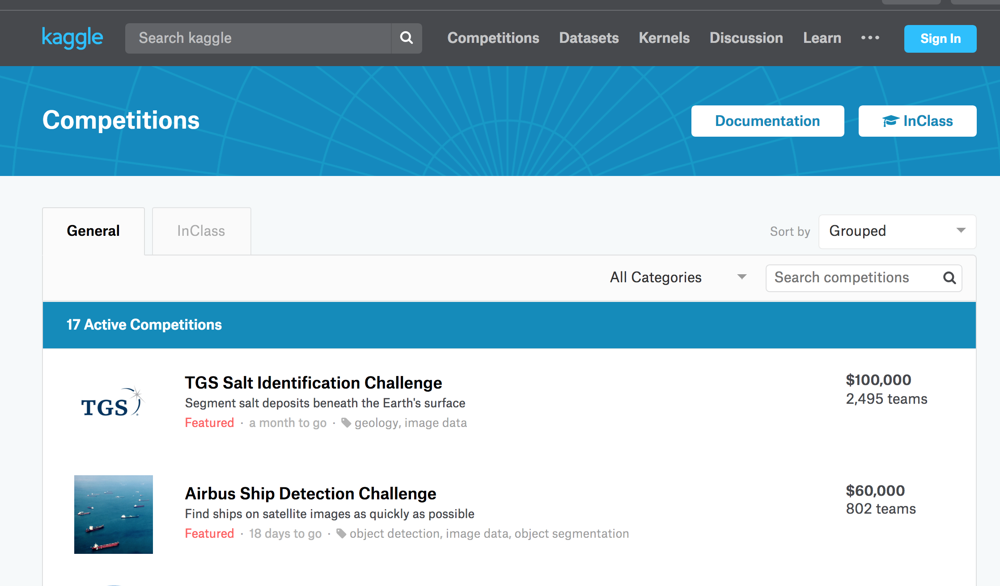
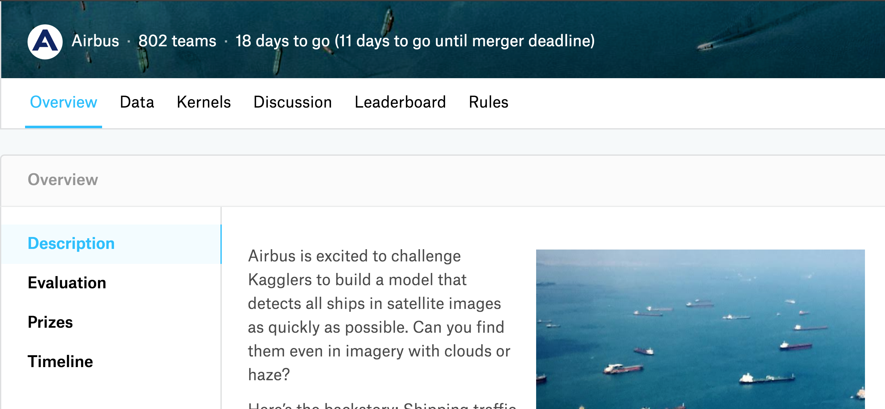
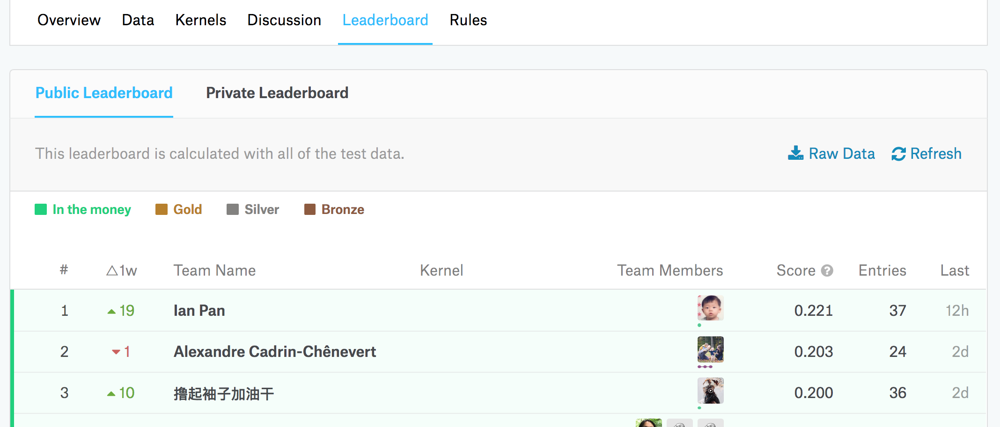

# Trang web tổ chức thi ML cho cộng đồng việt Nam 
<!-- MarkdownTOC -->

- [Trang web tổ chức thi ML cho cộng đồng việt Nam](#trang-web-t-chc-thi-ml-cho-cng-ng-vit-nam)
  - [1. Mục đích](#1-mc-ich)
  - [2. Cấu trúc](#2-cu-truc)
    - [2.1. Cuộc thi](#21-cuc-thi)
      - [2.2. Dữ liệu](#22-d-liu)
    - [2.3. Đội chơi và thành viên (Teams and members)](#23-i-chi-va-thanh-vien-teams-and-members)
      - [2.3.1. Lượt nộp](#231-lt-np)
      - [2.3.2. Điều kiện ghép đội (Merge team)](#232-iu-kin-ghep-i-merge-team)
      - [2.3.3. Trang thông tin thành viên](#233-trang-thong-tin-thanh-vien)
        - [2.3.3.1. Thông tin cá nhân](#2331-thong-tin-ca-nhan)
        - [2.3.3.2. Thông tin công cộng](#2332-thong-tin-cong-cng)
      - [2.3.4. Trang thông tin đội](#234-trang-thong-tin-i)
      - [2.3.5. Thủ tục ghép đội](#235-th-tc-ghep-i)
    - [2.4. Bảng xếp hạng trong một cuộc thi](#24-bng-xp-hng-trong-mt-cuc-thi)
    - [2.5. Nộp bài](#25-np-bai)
    - [2.6. Tính năng phát hiện gian lận](#26-tinh-nng-phat-hin-gian-ln)
    - [2.7. Bảng tổng sắp (ranking table)](#27-bng-tng-sp-ranking-table)
  - [3. Admin](#3-admin)

<!-- /MarkdownTOC -->

## 1. Mục đích
Hiện tại có rất nhiều các bài toán đặc thù của Việt Nam có thể được giải quyết
bằng Machine Learning (ML). Tuy nhiên, việc kết nối giữa các bên có nguồn lực
tài chính, cơ sở dữ liệu và nguồn nhân lực còn nhiều hạn chế khiến rất nhiều dữ
liệu quý giá chưa được sử dụng. Điều này là động lực khiến nhóm
muốn xây dựng một nền tảng thi đấu ML giống [Kaggle](kaggle.com) dành riêng cho
Việt Nam.

Trang web này sẽ có tên miền là AIviVN.com (chúng ta đã mua tên miền này). tên
này có nghĩa là _AI vì VN_, cũng có thể hỏi như một câu hỏi tu từ _ai vì VN?_. 

AiviVN hoạt động hoàn toàn với mục đích phi lợi nhuận  vì cộng
đồng, giúp giải quyết các bài toán khó của Việt Nam và các doanh nghiệp, đồng thời giúp sinh viên có
môi trường thực hành tốt. 

Khi tổ chức các cuộc thi ML, có ít nhất ba bên sẽ được hưởng lợi: 

* **Công ty**: Các công ty có dữ liệu nhưng chưa có các giải pháp tối ưu có thể
  đăng ký một cuộc thi trên aivivn.com. Họ cần đưa ra bài toán, dữ liệu, và giải
  thưởng để tổ chức cuộc thi. 

* **Người tham gia**: Có điều kiện học hỏi thông qua việc thực hành và thi đấu
  với các bài toán thực tế. 

* **Cộng đồng**: Lời giải cho các bài toán có thể được áp dụng cho các bài toán
  khác trên thực tế. Các đội giành giải cao cần công bố mã nguồn để cộng đồng có
  thể sử dụng lại. 

Ngoài việc tổ các **cuộc thi mở** như trên, trang web cũng có chức năng
giúp tổ chức các **cuộc thi đóng** cho sinh viên trong một lớp hoặc nhân
viên trong một công ty. Sự khác biệt duy nhất nằm ở việc: chỉ người tạo cuộc thi
riêng tư này mới được quyền mời thành viên tham gia; chỉ các thành viên được mời
mới có thể tìm kiếm và nhìn thấy cuộc thi này. 

## 2. Cấu trúc
_Hình ảnh trong các phần mô tả dưới đây được lấy trực tiếp từ Kaggle._ 

Trang chủ sẽ liệt kê các cuộc thi mở như hình dưới. Với các thành viên đã
đăng nhập, họ cũng nhìn thấy cả những cuộc thi đóng mà họ tham gia.

Trên trang chủ, mỗi cuộc thi được liệt kê cần hiển thị: 
* Ảnh đại diện 
* Tên gọi 
* Mô tả ngắn gọn
* Thời gian đã diễn ra 
* Thời gian còn lại 
* Tag 
* Giải thưởng
* Tên đơn vị tổ chức 
* Số đội tham dự 

### 2.1. Cuộc thi
Giao diện khi click vào mỗi cuộc thi như sau: 

Mỗi cuộc thi bao gồm các tabs: 
* Tổng quan: mô tả cuộc thi, cách tính điểm, giải thưởng, các mốc thời gian.
  Những thông tin này được nhập bởi người khởi tạo cuộc thi.  
* Dữ liệu: giới thiệu về dữ liệu, link download. Tạm thời AIviVN sẽ giới hạn
  dung lượng của bộ dữ liệu. Các bộ dữ liệu lớn hơn một ngưỡng cho trước sẽ được
  yêu cầu dẫn link từ bên ngoài. 
* Thảo luận: Phần thảo luận các vấn đề *liên quan* tới cuộc thi được link
  tới một *tag* tương ứng bên [diễn đàn](forum.machinelearningcoban.com). Chúng
  ta cần bàn thêm về việc các thảo luận riêng tư trên diễn đàn. Vấn đề này hơi
  phức tạp về cả nội quy và cách thực hiện. Nếu chúng ta không thể can thiệp vào
  việc tạo các tag riêng tư trên Discourse, chúng ta sẽ cần tách riêng phần user
  ở hai trang web ra. _Rất cần thảo luận thêm về vấn đề này_. 

* Bảng xếp hạng: Xếp hạng các đội tham gia. Xem thêm phần **Bảng xếp hạng** ở
  mục sau.

* Luật chơi: các luật đặt ra cho mỗi cuộc thi. 

#### 2.2. Dữ liệu
Mỗi cuộc thi có hai tập cơ sở dữ liệu:
* Dữ liệu huấn luyện (training data): Các đội sử dụng dữ liệu này để huấn luyện
  mô hình. Các đội có thể bị giới hạn việc có được dùng dữ liệu ngoài hay
  không. Việc sử dụng dữ liệu ngoài sẽ cho kết quả tốt hơn trong nhiều bài toán.
  Vì vậy, điều này đôi khi cần được khuyến khích. 
* Dữ liệu kiểm tra (test data): Dữ liệu dùng để đánh giá chất lượng mô hình. Dữ liệu này bao gồm hai tập con:
    * public test: Phần được dùng để hiển thị kết quả trên _Bảng xếp
      hạng mở_ (public leaderboard).
    * private test: Phần được dùng để hiển thị kết quả trên _Bảg xếp hạng đóng_
      (private leaderboard). Bảng xếp hạng đóng chỉ được hiển thị tới tất cả các
      đội ở một vài ngày gần cuối cuộc thi.
  
  Hai tập con này được trộn lẫn và chỉ ban tổ chức biết từng phần tử thuộc
      tập con nào. 

* Một file nộp mẫu (`sample_submission.csv`). File này dùng để giúp người chơi
  tham gia biết được cấu trúc của file nộp bài là gì (header , số lượng
  dòng,...)

Khi tạo một cuộc thi, người khởi tạo cần cung cấp file .csv chứa kết quả
chính xác của dữ liệu trong hai tập kiểm tra và một chương trình so sánh kết
quả. 

Cụ thể, người khởi tạo cuộc thi cần cung cấp thêm ba files: 
* File chứa kết quả (ground truth) của dữ liệu kiểm tra công cộng, thường ở dạng
  csv.
* File chứa kết quả của dữ liệu kiểm tra mở, ví dụ `public.csv`.
* File chứa kết quả của dữ liệu kiểm tra đóng, ví dụ `private.csv`.
* File nhận đầu vào là ba file `submission.csv, public.csv, private.csv`. Trả về
  điểm số của mỗi lần nộp trên tập kiểm tra mở và đóng. Các kết quả này sẽ được
  cập nhật trên các BXH mở và đóng. 

### 2.3. Đội chơi và thành viên (Teams and members)

Mỗi thành viên được tham gia bất kỳ cuộc thi mở nào và các cuộc thi riêng
tư được mời. Khi tham gia, mỗi thành viên được coi là một đội và là đội trưởng
của đội đó. Trong quá trình thi đấu, các đội có thể ghép thêm thành viên từ các
đội khác. Quy định ghép đội được cho ở mục 2.3.2.

Trong một cuộc thi, một thành viên không thể nằm trong hai đội khác nhau. 

#### 2.3.1. Lượt nộp 
Trong một ngày, mỗi đội được nộp một số lượng lượt nhất định `T` (mặc định bằng
5). Bất kể thành viên nào trong đội cũng được phép nộp bài nhưng tổng số lượng
không được vượt quá `T`. 

Việc giới hạn số lượng nộp này là quan trọng vì kết quả trên BXH mở có thể giúp các
đội biết được chất lượng của mô hình và đề ra các hướng cải thiện. Sẽ không công
bằng và thú vị nếu một đội được nộp vô số lần. 

#### 2.3.2. Điều kiện ghép đội (Merge team)
Hai đội `A` và `B` có thể ghép với nhau nếu thỏa mãn các điều kiện:

* Thời điểm yêu cầu ghép đội cách deadline ít nhất `d` (mặc định bằng 7)
  ngày. 

* Tổng số thành viên của hai đội không vượt quá `N` (mặc định băng 10). 
  
* Tại thời điểm ghép đội, tổng số lượt đã nộp của hai đội không vượt quá `T`
  nhân với số ngày mà cuộc thi đã diễn ra. Đồng thời, tổng số lượt đã nộp của
  hai đội _trong ngày hôm đó_ không được vượt quá `T`. 

* Nếu đội `A` muốn sáp nhập đội `B`, đội trưởng của `A` gửi yêu cầu tới đội
  trưởng của `B` và ban tổ chức (admin). Nếu đội trưởng của `B` đồng ý, admin sẽ
  xem xét và duyệt nếu hai đội có được ghép hay không. Nếu được sát nhập, hai
  đội không thể tách ra sau đó. Đội trưởng của đội `A` sẽ là đội trường chung.
  Các thành viên của đội `B` được tự động chuyển sang đội `A`. Các thông tin về
  đội `B` sẽ không được thể hiện trên BXH. 

Bảng dưới đây là ví dụ về trường hợp hai đội được ghép hay không, trong đó: 
* **`A` từ đầu**: tổng số lần nộp của đội `A` kể từ ngày cuộc thi diễn ra
* **`A` trong ngày**: tổng số lần nộp của đội `A` trong ngày hôm đó.
* Tương tự với **`B` từ đầu** và **`B` trong ngày** 
* **tổng từ đầu** = **`A` từ đầu** + **`B` từ đầu**
* **tổng trong ngày** = ** `A` trong ngày** + **`B` trong ngày**

| Ngày thứ | `A` từ đầu | `A` trong ngày | `B` từ đầu | `B` trong ngày | tổng từ đầu | tổng trong ngày | Được ghép? | 
|- | -|-|-|-|-| -|-|
| 1 | 1 | 1 | 2| 2 | 3 |3| Y | 
| 1 | 3 | 3 | 3 | 3| 6 | 6| N| 
| 2 | 4 | 2| 6 | 4| 10| 6| N|
| 3 | 6 | 1 | 8 | 3| 14 | 4| Y|
| 3 | 8 | 1 | 8 | 2| 16 | 3| N|

**Việc ghép đội trong một cuộc thi chỉ có giá trị trong cuộc thi đó.**

#### 2.3.3. Trang thông tin thành viên 
Mỗi thành viên có một trang thông tin cá nhân. Trang thông tin này bao gồm hai phần chính:

##### 2.3.3.1. Thông tin cá nhân 
* Tên tài khoản: không được đổi
* Tên thành viên: cc thể thay đổi 
* Ảnh cá nhân: có thể thay đổi 
* Đổi mật khẩu

##### 2.3.3.2. Thông tin công cộng 
1. Thứ hạng trên bảng tổng sắp (thứ hạng/tổng số thành viên của cả trang) 
   Thứ hạng này tương ứng với dòng của thành viên đó ở bảng tổng sắp (xem 2.7)

2. Danh sách các cuộc thi và các đội đã tham gia 

|STT | Cuộc thi | Tên đội | thứ hạng | đang diễn ra | rời đội/ghép đội |
| 1 | contest 1 | team A | 2/1000| đang diễn ra | rời đội | 
| 2 | contest 2 | team B | 1/10 | kết thúc | | 

Với các cuộc thi `đang diễn ra`, thành viên đó sẽ thấy nút `rời đội` ở 
cột cuối cùng nếu đội hiện tại có nhiều hơn 1 thành viên. Thành viên khác, nếu là 
đội trưởng của một đội khác trong cuộc thi tương ứng, sẽ nhìn thấy nút `ghép đội`. 

#### 2.3.4. Trang thông tin đội 
Từ Bảng xếp hạng của một cuộc thi, một thành viên bất kỳ (kể cả ngoài đội) có thể click vào 
từng đội để xem `Thông tin đội`. Trang `Thông tin đội` bao gồm các thành phần: 

1. Tên đội 

  
2. Danh sách thành viên: Danh sách này là một bảng, mỗi hàng là thông tin về 
   thành viên tương ứng với một dòng trong bảng tổng sắp (mục 2.7). Xếp theo thứ 
   tự thứ hạng thành viên từ cao đến thấp.

3. Số lần đã nộp từ đầu cuộc thi. Số lần nộp còn lại trong ngày (chỉ thành viên
   trong đội nhìn thấy). 

4. Danh sách các file csv đã nộp (chỉ thành viên trong đội nhìn thấy), bao gồm: 
   * Tên file (có thể download được) 
   * Điểm số tương ứng 
   * Thời gian nộp 
   
5. Yêu cầu ghép đội nếu thành viên đang xem ở ngoài đội và là đội trưởng của một
   đội khác. 

#### 2.3.5. Thủ tục ghép đội 
Để cho đơn giản, đội `A` được quyền yêu cầu ghép với đội `B` trong một cuộc thi
chỉ khi cả hai đội đã nộp ít nhất một lần cho cuộc thi đó. Tức hai đội đều đã 
có thông tin trên Bảng xếp hạng (mở).

Nếu đội `A` muốn ghép với đội `B`, đội trưởng đội `A` trước tiên vào BXH mở, tìm 
vị trí của đội `B`, click vào tên đội `B`. Trong trang thông tin của đội `B`, 
đội trưởng đội `A` sẽ nhìn thấy button `Yêu cầu ghép đội`. Nếu điều kiện 
trong mục 2.3.2. không thỏa mãn, một thông báo hiện lên nói: `Hai đội chưa được 
ghép vì tổng số lần nộp vượt quá ...`. 

Nếu điều kiện ghép đội thỏa mãn, đội trưởng đội `B` sẽ nhận được thông báo 
`Bạn nhận được một yêu cầu ghép đội từ A`. Đội trưởng đội `B` có quyền `từ chối` 
hoặc `đồng ý`. Nếu nhấn `đồng ý`, điều kiện ghép đội lại được kiểm tra lại (vì 
có thể hai đội đã nộp thêm kể từ khi đội trưởng đội `A` yêu cầu ghép). Nếu không 
thỏa mãn, thông báo tương tự `Hai đội chưa được ghép vì tổng số lần nộp vượt quá ...`
hiện ra với đội trưởng đội `B`. 

Nếu các điều kiện ghép đội thỏa mãn, hai đội được ghép vào một. Cần thực hiện:

* Thông tin đội `B` bị mất.
* Tên đội chung là `A`. 
* Toàn bộ các file nộp được ghép vào một bảng.
* Vị trí của đội `A` mới phụ thuộc vào điểm số chung cao nhất. 

**Lưu ý:**

* Đội chỉ tồn tại trong một cuộc thi. Sang cuộc thi mới tự động mỗi thành viên một đội. 
* Không thể tách đội sau khi đã ghép đội. 
* 

### 2.4. Bảng xếp hạng trong một cuộc thi
Bảng xếp hạng (BXH) là nơi được cập nhật nhiều nhất. Có hai BXH tương ứng
với dữ liệu kiểm tra công cộng và riêng tư. 

Dưới đây là ví dụ về một bảng xếp của Kaggle:

Mỗi hàng của BXH tương ứng với thông tin của một *đội*. Các thông tin này bao gồm:

* Thứ hạng: được xác định dựa trên _kết quả tốt nhất_ mà đội đó đã nộp. 

* $\Delta \text{rank}$: tăng hay giảm thứ hạng khi có một đội nộp bài.  
  Vào đầu tuần (thứ 2), hạng rank của mỗi đội được giữ cố định làm mốc so sánh tăng hay giảm trong tuần đó.
  Ví dụ: Đội `MLCB` đầu tuần đang ở rank 100. Trong tuần, đội đó cố gắng đạt được kết quả tốt.
  Giả sử sau một lần nộp bài nào đó, đội đó tăng lên rank 40, lúc này $\Delta \text{rank}$ = 60 rank
  và có mũi tên xanh chỉ lên biểu thị rank răng.
  Sau lần nộp thứ hai, đội đó tăng lên rank 10, lúc này $\Delta \text{rank}$ = 90 rank.
  Tuy nhiên, vào cuối tuần, các đội khác vượt đội `MLCB` khiến cho đội này rơi xuống rank 110.
  Như vậy $\Delta \text{rank}$ = 10 rank và có mũi tên màu đỏ đi xuống biểu thị rank giảm.

* Tên đội 
    * Tên đội mặc định (trường hợp này chỉ có một thành viên) sẽ là tên của thành viên đó.
    * Tên đội được đổi tên tuỳ ý. Tất cả thành viên đều có thể để tên đội.

* Ảnh đại diện các thành viên 
    * Khi số lượng thành viên quá nhiều, không hiển thị đủ thì chỉ hiển thị 4 thành 
      viên bao gồm trưởng nhóm (leader) đầu tiên vả random ba bạn còn lại.

* Điểm số: Đầu ra của hàm `evaluate(public/private.csv, submission.csv)`

* Số lượt nộp: Tổng số lượt đã nộp của đội đó. 

* Lần gần nhất: Thời điểm nộp bài gần nhất của đội (thời điểm tương đối).

Một số lưu ý: 
* Đối với mỗi cuộc thi, giới hạn hiển thị số thập phân của kết quả là có thể tuỳ chỉnh được
  Ví dụ: Nếu kết quả nộp là 0.8123456 thì mình có thể chọn cách hiển thị là 0.81 hay 0.8123

* BXH được cập nhật khi một đội nộp bài 

* Chỉ cập nhật kết quả tốt nhất của mỗi đội 

* Khi hai đội ghép vào nhau, hiển thị kết quả tốt hơn của hai đội. 

* BXH mở chỉ được mở sau khi tới deadline của cuộc thi. Kể từ khi BXH mở được
  mở, các đội không được nộp bài. 

**Thứ tự trên bảng xếp hạng được xác định dựa trên ba yếu tố sau:** 
  
* Điểm số tốt nhất trong các lượt nộp
  
* Nếu bằng nhau, xét đến số lượt đã nộp 
  
* Nếu vẫn bằng nhau, xét thời điểm nộp có điểm số tốt nhất. Đội nộp trước xếp trên. 

### 2.5. Nộp bài 
Cần có một tab *Nộp bài* có hai chức năng chính: 

* Cho phép thành viên nộp một file .csv. Thành viên chỉ được nộp nếu tổng số
  lượt nộp trong ngày của đội tương ứng nhỏ hơn `T`. 

* Các đội chơi có thể thêm những ghi chú (comment) cho bài nộp của mình.
* Cấu trúc mỗi file .csv cần phải theo đúng format giống như file
  `simple_submission.csv` (đúng header và số lượng dòng)
* Hàng ngày, số lượng nộp bài sẽ được reset vào lúc 0:00 tính theo giờ Việt Nam

* Thành viên có quyền xem và download các file .csv đã nộp của đội.
* Cần ghi rõ thông tin người, thời gian, tên file và ghi chú đối với mỗi file nộp.

### 2.6. Tính năng phát hiện gian lận

Để được nộp nhiều lượt, một người có thể gian lận tạo nhiều tài khoản. Việc này
cần được hạn chế, nếu không sẽ giảm hứng thú của cuộc thi. Việc phát hiện này có
thể dụng machine learning để thực hiện nếu có lượng dữ liệu đủ lớn. Khi chưa có
dữ liệu, chúng ta có thể làm một thuật toán đơn giản là xác định địa chỉ IP của
mỗi lượt nộp bài. Nếu hai đội khác nhau có file nộp tại cùng địa chỉ IP thì ta
coi cả hai đội đó gian lận. Kết quả của hai đội sẽ không được tính đến khi trao
giải. 

### 2.7. Bảng tổng sắp (ranking table)
Việc xếp hạng các thành viên được thực hiện dựa trên kết quả cuối cùng của mỗi cuộc thi. 
Nếu một đội phạm luật, toàn bộ thành viên của đội sẽ không được xếp hạng trong cuộc thi đó. 

Mỗi thành viên trong đội xếp nhất, nhì, ba trong mỗi cuộc thi được trao cho một
huy chương vàng, bạc, hoặc đồng tương ứng. Bảng xếp hạng thành viên trên toàn bộ các cuộc thi được xác 
định như sau: 

* Số HCV (top 0-1%)
* Số HCB (top 1-5%)
* Số HCĐ (top 5-10%)
* Thứ hạng cao nhất trong các cuộc thi đã tham gia. Các cuộc thi mà thành viên
  này giành huy chương sẽ không được xét nữa. 

Bảng xếp hạng thành viên có dạng như sau: 

| Thứ hạng | Thành viên | HCV | HCB | HCĐ | Thứ hạng cao | Tham gia | 
| - | - | - | - | - | - | -|
| 1 | Tiệp | 10 | 0 | 0 | 4 | 14 | 
| 2 | Bắc | 9 | 1 | 4 | -| 14 | 

Nếu dài có thể chia thành nhiều trang nhỏ. 

_Đây là cách tính đơn giản tạm thời. Về lâu dài, BXH sẽ phức tạp hơn, chúng ta
sẽ tập trung phần này sau_ 

## 3. Admin 

Admin có các quyền sau: 

*  **Tạo cuộc thi**: giao diện tạo cuộc thi giống hệt giao diện 'cuộc thi' nhìn
   từ phía người dùng. Chỉ khác ở chỗ admin edit được. Các thông tin này bao gồm: 
   * Toàn bộ thông tin về cuộc thi. 
   * `T`, `d`, `N`. 

* **Chỉnh sửa thông tin cuộc thi**: Khi click vào một cuộc thi, các thông tin
  trên đó có thể sửa được. 

* Loại đội chơi ra khỏi một cuộc thi nếu thấy phạm luật. Nếu một thành viên phạm
  luật (luật cho admin và BTC xem xét), cả đội sẽ bị loại khỏi cuộc thi. 

* Xóa thành viên khỏi trang 

