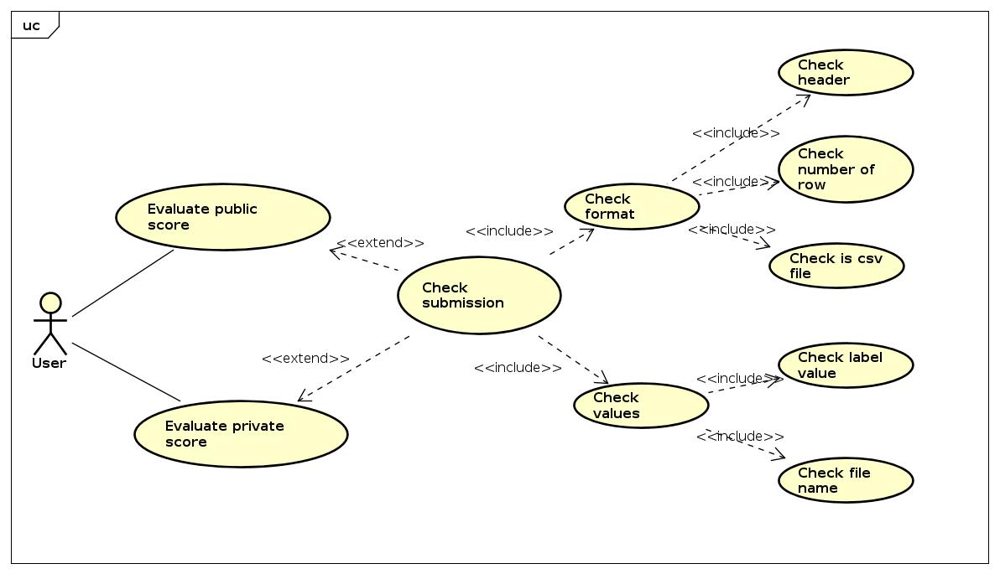
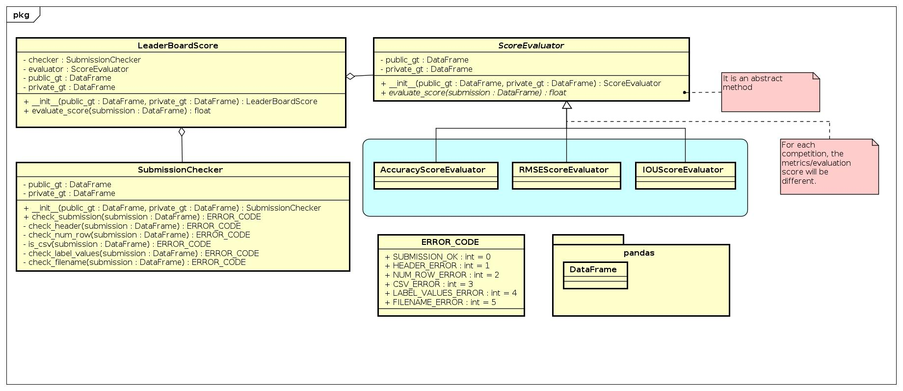
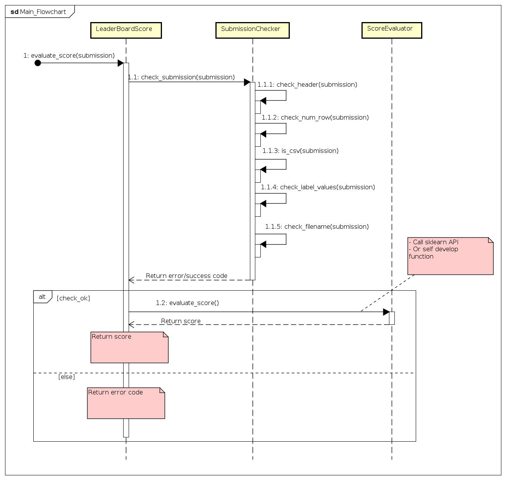

# Bản thiết kế module Leader Board Score

## 1. Giới thiệu
Module **Leader board Score** dùng để tính điểm của một bài nộp (submission) của một đội 
trên bảng xếp hạng public và private.

## 2.  Usecase diagram 

 
Để tính được điểm public và private, cần phải kiểm tra file submission trước, bao gồm: 
* Kiểm tra xem file có phải là csv hay không 
* Kiểm tra header có giống với ground truth hay không 
* Kiểm tra số dòng có giống với ground truth hay không 
* Kiểm tra giá trị của label có thỏa mãn so với ground truth hay không.  
Ví dụ:  
Trong bài toán dự đoán chữ số viết tay (MNIST), giá trị label chỉ được nằm trong 
khoảng `[0-9]`
* Kiểm tra xem file name dự đoán có thỏa mãn so với ground truth hay không.  
Ví du:  
Trong bài toán dự đoán chữ số viết tay (MNIST), có 1000 bức ảnh cần phải dự đoán được 
đánh số theo thứ tự `[0.png, 1.png, ... 999.png]`. Điều này có nghĩa là file name dự đoán trong 
file submission không thể có giá trị `1000.png`

## 3. Class diagram

## 4. Main sequence diagram

